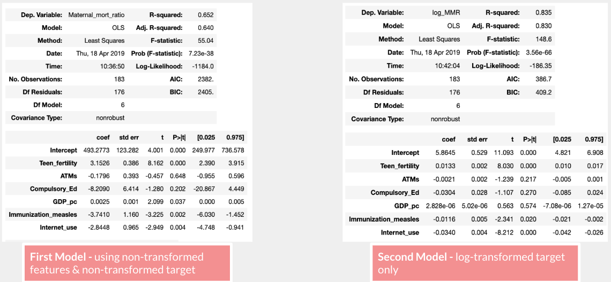
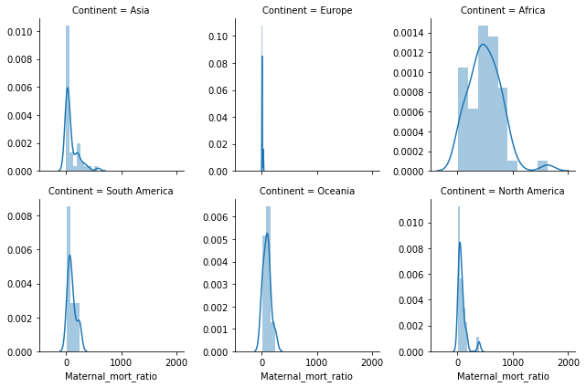

# Maternal_Mortality
Flatiron School // Mod2 Linear Regression Project  
By: Samantha Jackson

## Purpose
This project aims to test if there is a linear relationship between world development indicators and Maternal Mortality Ratio using an ordinary linear regression model. After a number of iterations, the best results, with an R-squared of .893, came from using a log transformed dependant variable.

## Data
Data was pulled from The World Bank Databank, more specifically the world development indicators database.  Data was output to a CSV, which made import to a pandas Dataframe easy.  The initial dataset included 69 features (development indicators) for 216 countries over 40 years. I also scraped "Region" and "Continent" from Statistics Times.

https://databank.worldbank.org/data/reports.aspx?source=world-development-indicators#

http://statisticstimes.com/geography/countries-by-continents.php

The features included in the model were: 
- **Maternal Mortality Ratio**: Maternal deaths per 100K live births
- **Teen Fertility**: Births per 100K women ages 15-19
- **Immunization Measles**:  % of children ages 12-23 months immunized for measles
- **Internet Use**: % of population using the internet
- **GDP_pc**: Gross Domestic Product per capita
- **Continent**
- **IUxEurope**: Interaction of Internet Use and Europe

## EDA
I narrowed my dataframe down to 6 features based on data availability and an attempt to avoid multicoliniarity.  

The only feature that looks somewhat normal is Compulsory Education.  Other feature distributions are positively (right) skewed, except for Immunizations.  This led me to believe I'd need to try transforming my features for my model.  

This pairplot reiterates the need to transform features since few of the relationships between Maternal Mortality Rate and the other features are linear.  

## Model Training
As a baseline, I threw all untransformed features into a model to see the results, and the R^2 wasn't great.  Testing my observations from EDA, I ran the same model with a log-transformed dependant variable and my R^2 increased about 20%.

After a few iterations of the model, I realized I may be able to improve the model by adding Continent as a feature.  I took a look at Maternal Mortality Ratios by continent.

